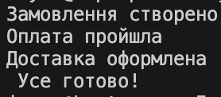

# Facade
Ідея фасадy: 

спрощує складну систему, даючи один зручний інтерфейс.

Як працює код: 

Клієнту не потрібно знати, як саме оформлюється замовлення, оплата й доставка — він просто викликає один метод MakeOrder().
Це робить код чистим, зрозумілим і легким у підтримці.

Навіщо: 

зменшує складність і полегшує використання коду.

## Код
```csharp
using System;

class Order
{
    public void Create() => Console.WriteLine("Замовлення створено");
}
class Payment
{
    public void Pay() => Console.WriteLine("Оплата пройшла");
}
class Delivery
{
    public void Send() => Console.WriteLine("Доставка оформлена");
}

class ShopFacade
{
    private Order o = new Order();
    private Payment p = new Payment();
    private Delivery d = new Delivery();

    public void MakeOrder()
    {
        o.Create();
        p.Pay();
        d.Send();
        Console.WriteLine(" Усе готово!");
    }
}

class Program
{
    static void Main()
    {
        var shop = new ShopFacade();
        shop.MakeOrder();
    }
}

```
## Результат

